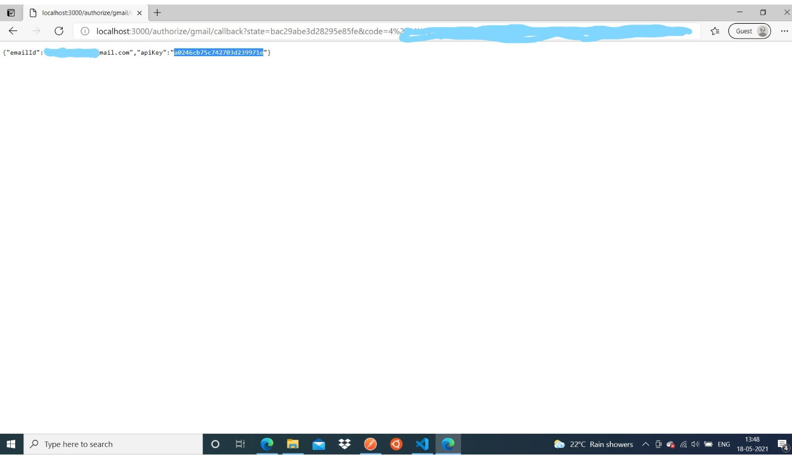
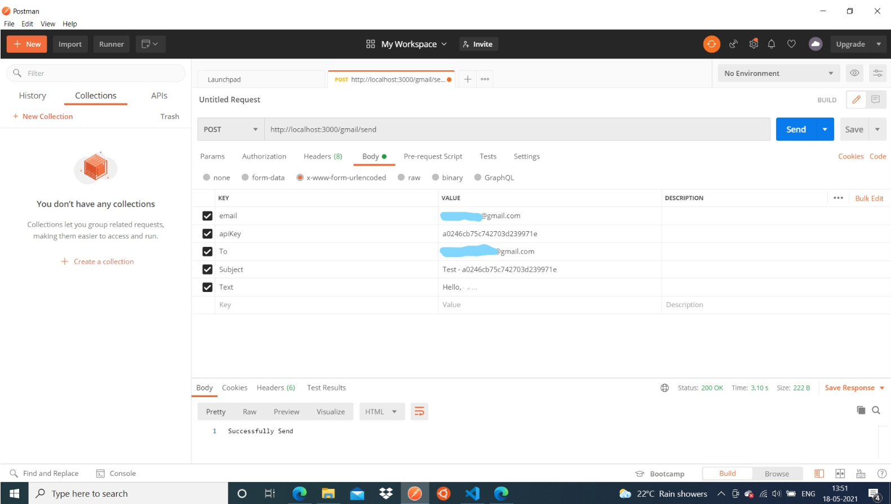
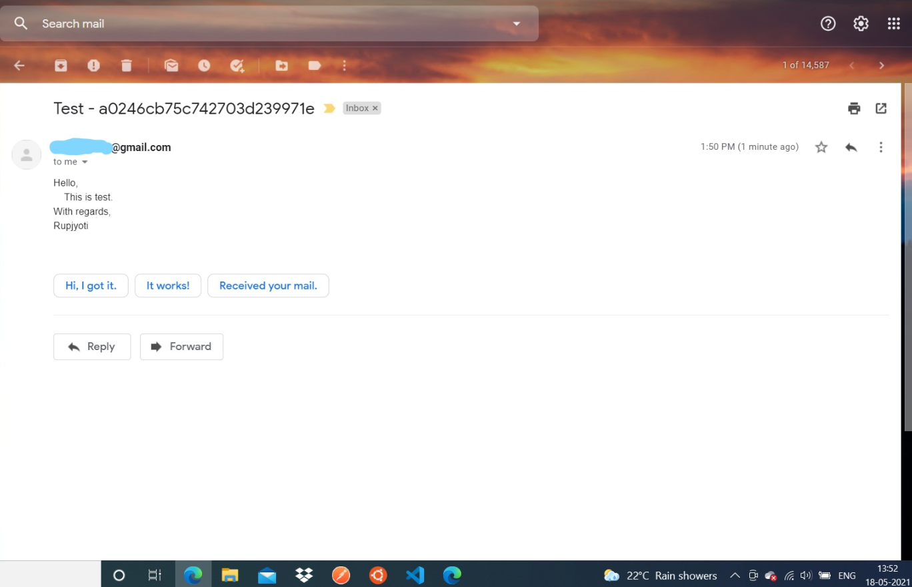

# Gmailsend

Send Email using Gmail REST API & OAuth 2.0 without using Google Client Library. Exposes Express.js API/Routes for authorization & sending emails.

Note: For now, only simple plain text message can be send to one recevier, with no support for attachments.


## Prerequisites

Generate OAuth Credentials by signing into Google Developer Console. Enable the Gmail API.

Check [here](https://developers.google.com/identity/protocols/oauth2/web-server#prerequisites) for more info.

**Download the client secret/credentials json file & rename it to credentials.json**

**Add some test emails so you can test. Google now does not allow unregistered emails for test projects.** (Emails can be send to anyone, but users cannot use your projects if not already registered as test emails)

## Installation & setup

Make sure you have **Node.js** & npm installed.

1. Install the dependencies by using
    ```bash
    npm install
    ```

2. Create a .env file and add a variable SESSION_SECRET and assign a random string. This will be used by express-session.

    eg. SESSION_SECRET=abhueijvie684786

3. Create a directory called user_credentials . The user tokens will be stored inside this directory.

4. Place the credentials.json (check Prerequisites) file inside the project folder (The file will be along with index.js, package.json files)

## Running

Run by typing ```node .``` or ```node index.js```

SERVER will listen on PORT 3000

## Routes/APIs

**GET /authorize/google**

User needs to visit this route (using browser) & will be redirected to Google Sign In page for authorization.

**GET /authorize/gmail/callback**

Once authorized, Google redirects to this route. The **email** & an application generated **apiKey** will be returned in json format. User needs to keep this apiKey properly. Cannot be retrieved again (Not in this project).

The apiKey is required in the SEND route.

In general, apiKey may not be required because user will not trigger the sending of email, but for this project.

***Note: The above route should have been '/authorize/google/callback , but I already registered the callback while creating credentials in Google Developer Console. Of Course, name doesn't matter for project to work but proper naming convention is important.***

**POST /gmail/send**

This is the email sending route/API.

On successfull sending, "Successfully Send" text will be returned.

**The required parameters are email, apiKey, To, Subject & Text**

email: The user/sender email. Must match with the registered email. ***Otherwise 401 will be returned.***

apiKey: Provided during authorization by the application. ***If wrong 401 will be returned.***

To: The recepient email id.

Subject: The email subject.

Text: The actual message content. 

eg. 

"Hello XYZ,

Hope you are doing well. This is a GMAIl REST API test.

With Regards,
ABC"

The newlines will be retained.

***If any of the parameters not provided, 400 status will be returned.***

## Refreshing Tokens

**The application gets new access_token if it expires.** So, emails can be continously send without requiring the users to authorize again.

## Screenshots




## References

* https://developers.google.com/identity/protocols/oauth2/web-server
* https://developers.google.com/gmail/api/guides/sending
* https://developers.google.com/gmail/api

## Acknowledgements

Thanks to 3rd party modules.

* [axios](https://www.npmjs.com/package/axios) : For http request/response
* [Expressjs](http://expressjs.com/) : Web Framework
* [express-session](https://www.npmjs.com/package/express-session) : For sessions
* [jsonwebtoken](https://www.npmjs.com/package/jsonwebtoken): For decoding JWT token
* [dotenv](https://www.npmjs.com/package/dotenv): For .env file

## Limitations/Improvements

* MIME message itself seems to be a different topic. So, handling attachments or html or inline image, etc are not taken care. Can do that later.

* I am using in memory session for storage. This is not suitable for production.

* If user registers multiple times, new file is generated & credentials gets stored. Should be able to delete earlier credentials. But, I did not stress on this part as this is just a personal project.


## LICENSE
(c) 2021, Rupjyoti Nath

MIT License

Check LICENSE file.